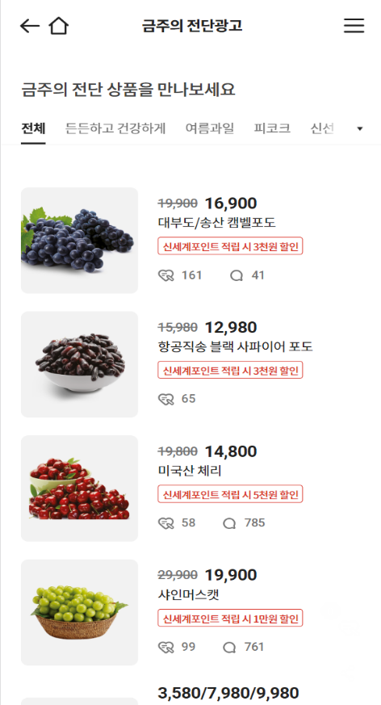

# [emart X SSAFY] 1차 Tech-fit 사전과제


## 💁프로젝트 소개

- 개발기간 : 2022.08.25 ~ 2022.08.30 

- [emart X SSAFY] Front-end Engineer 1차 면접전형 사전과제 입니다.

- emart App 내 금주의 전단광고 화면을 출력하는 SPA 앱 입니다.

## 🛠 사용한 기술 스택

- Vue@2.6.14
- vue-router@3.5.1
- swiper@4.4.1
- axios@0.27.2
- lodash@4.17.21
- vue-awesome-swiper@3.1.3
- HTML5/CSS3
- Javascript

## 📄 과제 요구사항

### 다음 이미지와 같은 화면을 출력하는 SPA 앱을 만드세요




1. API 통신을 사용하여 JSON 데이터를 가져와서 화면을 구성해주세요.

   > local에 있는 JSON 데이터를 axios 라이브러리를 사용해 Parsing했습니다.

   a.  각 아이템 Parsing을 위한 코드

   ```js
   // ProductList.vue
       // JSON Data Parsing
       parseData(list){
         list.forEach((item) => {
           // 원가 comma(,) 추가
           item.originPrice = parseInt(item.price).toLocaleString();
           // 할인가 계산
           if (item.discount){
             let p = 0
             let v = ''
             // 할인값이 100미만이면 %할인
             if (item.discount.value < 100){
               p = item.price * (1 - item.discount.value/100);
               v = item.discount.value;
               item.discount.value = `${v}%`;
             }
             // 할인값이 100이상이면 금액할인
             else {
               p = item.price - item.discount.value;
               v = item.discount.value;
               item.discount.value = `${v}원`;
             }
             // comma 추가
             item.discountedPrice = p.toLocaleString();
           }
         })
         this.selectedList = list;
       },
   ```

   b. 카테고리 Parsing을 위한 코드

   ```js
   // ProductList.vue
   	// Set 객체를 사용해 중복카테고리를 제거
       getCategory(list){
         // 배열의 각 원소에서 카테고리만 추출해 새로운 배열 생성
         const Arr = list.map(item => item.category);
         // Set 객체로 변환
         const set = new Set(Arr);
         // 중복이 제거된 Set객체를 다시 새로운 배열에 구조분해 할당
         this.categories = [...set];
       },
   ```


2. 스크롤을 이용한 10개 씩 리스트 페이징 처리를 해주세요. 

   > vue의 v-for를 이용해 각 아이템을 자식 컴포넌트로 두고, 전체 데이터리스트를 해당 페이지 수 만큼 slice해 전달하는 방식과
   >
   > window 객체에 scroll eventListener를 추가해 구현했습니다.
   >
   > 또한 lodash(_) 라이브러리의 throttle 메서드를 사용해 실행횟수를 제한해 성능을 최적화 했습니다.

   a. 이벤트리스너 추가를 위한 코드

   ```js
   // ProductList.vue
   // 스크롤이벤트 추가
   window.addEventListener('scroll', _.throttle(() => {
       ...
       // 현재 스크롤의 Y값과 보고있는 화면의 height값의 합이 전체 document의 height보다 크다면 다음 페이지를 추가
       if(window.scrollY+window.innerHeight >= document.documentElement.offsetHeight){
           this.pageNumber+= 1;
       }
       ...
   }),500)
   ```

   b. v-for를 사용해 자식 컴포넌트에 데이터를 전달하는 코드

   ```js
   <ProductItemVue 
       v-for="(item, idx) in selectedList.slice(0, pageNumber*10)"
       :key="idx"
       :product="item"
   />
   ```

    

3. 메뉴 좌우 스크롤, 메뉴 클릭 시 데이터 필터링, 클릭된 메뉴 on/off 표시가 될 수 있도록 처리해주세요.

   > swiper 라이브러리를 사용해 좌우스크롤을 구현했습니다.
   >
   > 메뉴 클릭 시 emit이벤트를 발생시켜 카테고리에 클래스를 추가하여 on/off 표시를 하였고,
   >
   > 같은 방식으로 데이터를 새로 Parsing해 필터링을 구현했습니다.

   a.  클릭 시 메뉴 on/off를 위해 클래스를 변경하는 코드

   ```js
   // SubmenuTab.vue
   // 카테고리 변경시 
   changeCategory(val) {
       // 최상단으로 이동
       window.scrollTo({ top:0, behavior:"smooth"});
       // 기존 check표시 해제
       const currentSelectedItem = document.querySelector(`#item-${this.selectedCategory}`);
       currentSelectedItem.classList.remove('selected');
       // 새로 check표시 ON
       const newSelectedItem = document.querySelector(`#item-${val}`)
       newSelectedItem.classList.add('selected')
       this.$emit('changeCategory', val);
   }
   ```

   b. 클릭 시 데이터를 새로 Parsing하는 코드

   ```js
   // ProductList.vue
   // emit이벤트가 발생했을 때 카테고리 및 데이터리스트 변경
   changeCategory(val){
       if (val=='all'){
           this.selectedCategory = 'all';
           this.selectedList = this.allList;
       }
       else{
           // props 데이터 양식에 맞춰 String으로 파싱
           this.selectedCategory = String(val)
           this.selectedList = this.allList.filter((item) => {
               return item.category == this.categories[val]
           })
       }
   }
   ```

   

4. 스크롤 다운 메뉴 숨김 / 스크롤 업 메뉴를 표시해주세요.  

   > window에 scroll EventListener를 추가해 up/down 이벤트를 감지했고
   >
   > 메뉴에 클래스를 추가하는 방식으로 구현했습니다.

   a. window EventListener 코드

   ```js
   window.addEventListener('scroll', _.throttle(() => {
       // 현재 스크롤의 top을 저장
       let currentScrollTop = document.documentElement.scrollTop;
       const header = document.querySelector('.head');
       const swiper = document.querySelector('.my-swiper');
       // 기존 스크롤보다 top이 높아지면 scroll down > 탭 보이기
       if (lastScroll < currentScrollTop){
           header.classList.remove('hide');
           swiper.classList.remove('hide');
       }
       // 기존 스크롤보다 낮아지면 scroll up > 탭 숨김
       else {
           header.classList.add('hide');
           swiper.classList.add('hide');
       }
       // 기존 스크롤 갱신
       lastScroll = document.documentElement.scrollTop;
       // throttle을 부여해 성능 최적화
   }),500)
   ```


5. 화면 해상도에 따라 리스트 배열을 변경해주세요. (1열 → 2열, 2열 → 3열)

   > css의 media query를 사용해 구현했습니다.
   >
   > viewport별로 flex-basis값을 전체 width를 등분해 배분하였습니다.

   a. media query를 사용한 코드

   ```js
   // ProductItem.vue
   /* PC */
   @media screen and (min-width: 1440px){
     .product-item{
       flex-basis: 33.3%;
     }
   }
   /* Tablet */
   @media screen and (max-width: 1440px){
     .product-item{
       flex-basis: 50%;
     }
   }
   /* Mobile */
   @media screen and (max-width: 768px){
     .product-item {
       flex-basis: 100%;
     }
   }
   ```


## 📺앱 화면

- 모바일화면


- 태블릿화면


- PC화면


## 💻 프로젝트 실행

1. 원격 저장소 복제

   ```
   $ git clone https://github.com/asooso12/emartapp
   ```

2. 프로젝트 폴더로 이동

   ```
   $ cd emart
   ```

3. 필요한 node_modules 설치

   ```
   $ npm install
   ```

4. 로컬 서버 실행

   ```
   $ npm run serve
   ```


## 😀개발자 소개

| 이진석 (FrontEnd)<br /> | github : https://github.com/asooso1<br />contact : amateur@kakao.com |
| :--------------------------------------------------: | :----------------------------------------------------------: |

